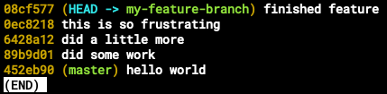
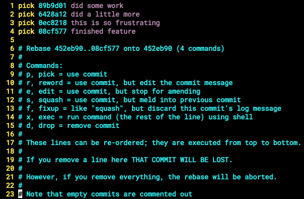
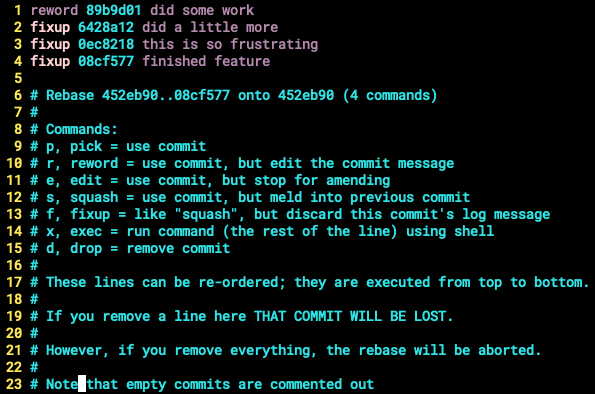
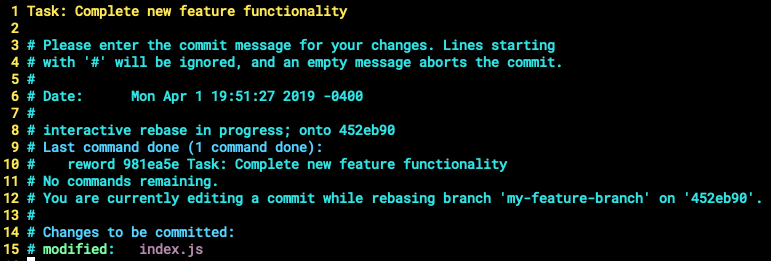
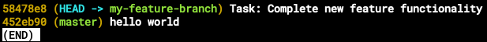

Hey, let's talk a bit about git 😉

Let's say you've been given the task of creating a new feature at work. You created a new branch with `git checkout -b my-feature-branch` and you are being careful to make many commits to keep track of your progress.

We've all created commit messages that weren't too helpful or descriptive. You completed the task and you're ready to create a PR (pull request), but you realize the only commit that really matters here is the most recent one, `finished feature`. There isn't a reason to push all of these commits to the remote repo. You can use interactive rebase to clean up your feature branch prior to pushing and creating your PR.

Let's say you want to squash the commits on `my-feature-branch` into a singular, descriptive commit.

You can run `git rebase -i HEAD~4`, which will open your text editor in interactive mode. It should look something like this:

So we have the last 4 commits listed from **oldest to most recent** along with a helpful description of the commands available in interactive mode. We see the last 4 commits on `my-feature-branch` because we specified that we wanted to interact with the last 4 commits via the `HEAD~4` option. The `HEAD` of your branch is the most recent commit on the checked out branch. So, we're saying "Hey, I want to interact with `HEAD` commit plus the three most recent commits on `my-feature-branch`. The `4` in our command is an arbitrary number and can be changed at your discretion.

Cool. So we know we want to `squash` down our commits into a singular commit. So let's `fixup` our commits and `reword` the resulting commit to have a more descriptive message. `fixup` is like squash, but discards the commit's log message and `reword` picks the commit and allows you to change the commit's log message.

After saving the changes made in interactive mode, you will be prompted to provide the new log message for your reworded commit. In our case here, we are changing the `did some work` message to properly reflect the changes that were squashed from the other commits.

After saving your new, shiny commit message, your commit history should be squashed into one, descriptive commit that contains your changes made on `my-feature-branch`!

Awesome! `rebase` is an extremely powerful tool that does much more than renaming commits! Some teams prefer to rebase feature branches onto their main working branches instead of using the more conventional merge commit workflow. However, there are caveats to using a rebase workflow that you must consider. When you rebase, you are **rewriting history**, so all rebasing should be done on local branches only! I suggest checking out [this](https://www.atlassian.com/git/tutorials/merging-vs-rebasing) article that does an amazing job of explaining `rebase` and things to look out for.

That's it, for git. Ok, I'll see myself out.
